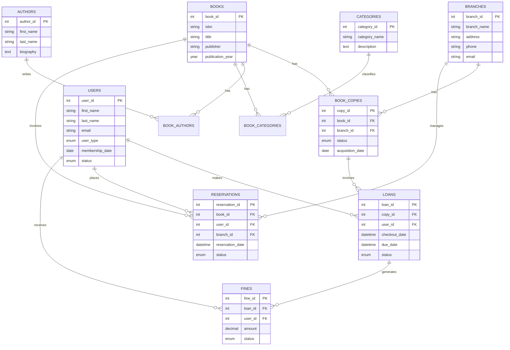

# week8-database-assignment
# Library Management System

A comprehensive database system designed to manage library operations including book inventory, patron management, loans, reservations, and fine tracking across multiple branches.

## Project Description

This Library Management System database is designed to handle all aspects of library operations:

- Multiple branch management
- User management (staff and patrons)
- Book catalog with detailed metadata
- Individual book copy tracking
- Author and category management
- Loan and reservation system
- Fine management
- Comprehensive audit tracking

## Database Schema

The database consists of the following main components:

### Core Tables
- `branches` - Library locations
- `users` - Library staff and patrons
- `books` - Book catalog
- `book_copies` - Individual copies of books
- `authors` - Book authors
- `categories` - Book categories/genres

### Transaction Tables
- `loans` - Tracks book checkouts and returns
- `reservations` - Handles book reservations
- `fines` - Manages overdue fines

### Relationship Tables
- `book_authors` - Links books to authors (M:M)
- `book_categories` - Links books to categories (M:M)

## Entity Relationship Diagram (ERD)



## Setup Instructions

1. Ensure you have MySQL installed on your system
2. Create a new database:
   ```sql
   CREATE DATABASE library_management;
   USE library_management;
   ```
3. Import the schema:
   ```bash
   mysql -u your_username -p library_management < library_management.sql
   ```

## Features

- Robust Data Integrity: Enforced through foreign key constraints and proper indexing
- Audit Trail: All tables include creation and modification timestamps
- Status Tracking: Enumerated types for various status fields
- Performance Optimization: Indexes on frequently queried columns
- Multi-branch Support: Designed to handle multiple library locations
- Comprehensive User Management: Handles both staff and patron accounts
- Complete Transaction Tracking: Loans, reservations, and fines

## Database Design Considerations

- Scalability: Designed to handle growth in both data volume and feature set
- Maintainability: Well-structured schema with clear relationships
- Performance: Strategic indexing on commonly queried fields
- Data Integrity: Comprehensive constraints and foreign key relationships
- Flexibility: Support for future feature additions through extensible design